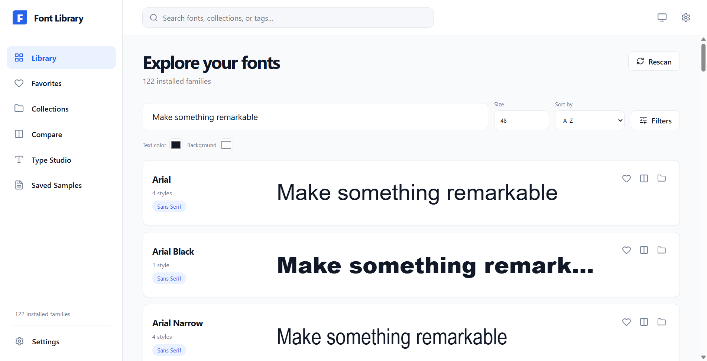
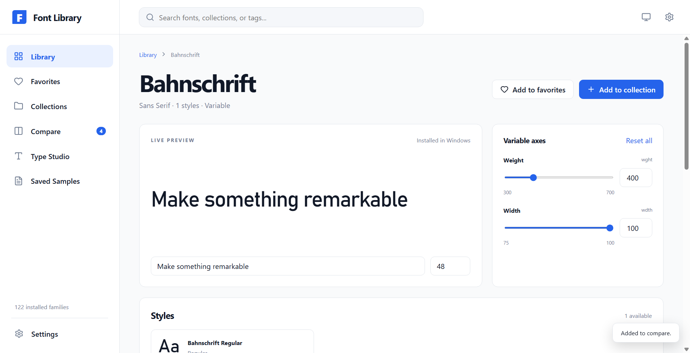
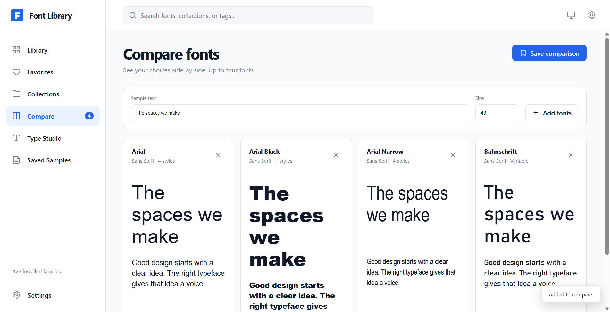
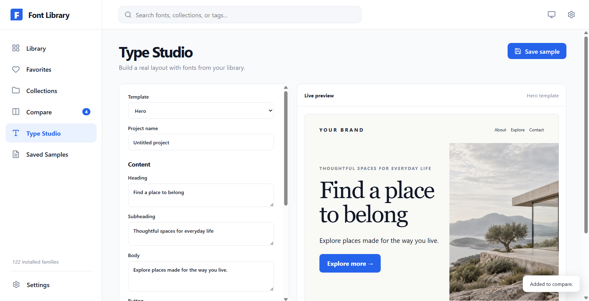
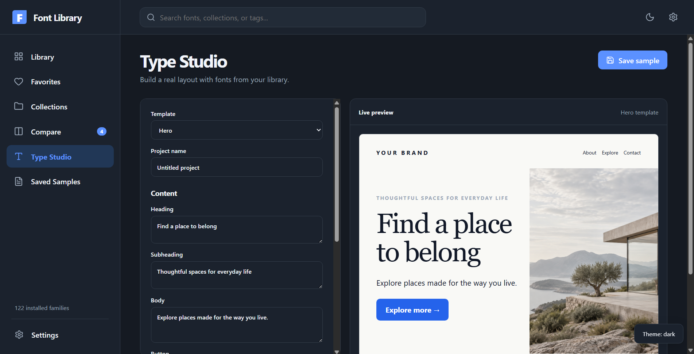

# Font Library

Preview the fonts you installed on Windows. Compare type choices, adjust variable font axes, and save layouts you want to revisit.



## Get the app

Open this repository's **Releases** page and download `Font-Library-Setup-1.0.0.exe`. The installer adds a desktop shortcut and a Start menu entry. Windows may show a SmartScreen warning because the installer has no code-signing certificate.

You need Windows 10 or 11 on an x64 PC. You do not need an account.

## Explore your fonts

| Area | You can |
| --- | --- |
| Library | Preview one line across your installed fonts, search, filter, and sort. |
| Font detail | Inspect styles and character support, tune variable axes, and add notes or tags. |
| Compare | View up to four fonts beside the same text. |
| Collections | Group favorites and save font pairings. |
| Type Studio | Start with Hero, Editorial, Poster, Mobile UI, Logo, or Blank; edit text, fonts, colors, and layout. |
| Saved Samples | Reopen comparisons and Type Studio projects. |
| Settings | Pick Light, Dark, or System theme; rescan fonts; export or import your library data. |

<details>
<summary>See more screenshots</summary>

### Font detail



### Compare



### Type Studio





</details>

## How the catalog stays current

Font Library reads fonts registered for your Windows account and the computer. The app checks that each font file exists. It scans on launch, when you return to the window, once a minute while open, and when you select **Rescan**. Remove a font through Windows and the app removes it from the catalog after the next scan.

You can delete a downloaded `.ttf` or `.otf` after Windows has installed it, as long as Windows still has the installed font file. Font Library does not keep its own font copies. It stores your favorites, notes, collections, and projects in a local JSON file. An exported backup contains those choices and font names, not the font files.

## Build from source

Install [Node.js 24](https://nodejs.org/en/download) on Windows x64, then run:

```powershell
npm ci
npm run build
npm run app
```

To create the Windows installer, run `npm run dist`. The EXE appears in `dist-installer/`. If your Electron download did not finish during `npm ci`, run `node node_modules/electron/install.js` and retry.

Read [the architecture notes](docs/ARCHITECTURE.md) for the Windows scan, local storage, and renderer. Read [the contribution guide](CONTRIBUTING.md) before you propose a change.

## Project status

The first release supports Windows x64 and an English interface. We welcome bug reports and focused contributions. Read the [security policy](SECURITY.md) before you report a vulnerability.

Font Library uses the [MIT License](LICENSE). The repository contains no third-party font files.
